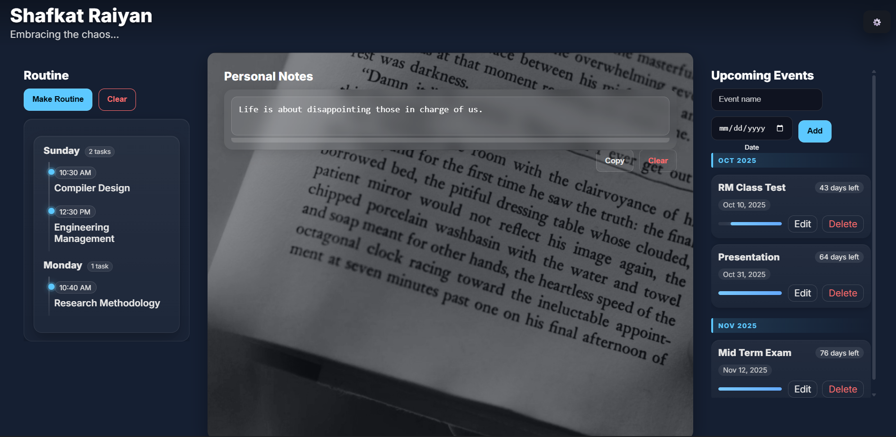

# 🌐 Simple Personal Planner Website  

### 📌 Short Description  
A **personal diary-style website** built with Flask, HTML, CSS, and JavaScript.  
It includes login-protected notes, class routine management, upcoming event tracking, and a customizable background photo — all synced with Firebase and deployed on Vercel.  

---

## 📂 Project Structure
- `templates/index.html` → Main HTML template (Flask-rendered)  
- `static/style.css` → Stylesheet for UI design (modern, responsive)  
- `static/app.js` → Frontend logic (notes, routine, events, photo cropper, Firebase sync)  
- `app.py` → Flask backend entry point  
- `requirements.txt` → Python dependencies (Flask)  
- `vercel.json` → Deployment config for Vercel  

---

## ⚙️ Technologies Used
- **Frontend:**  
  - HTML5  
  - CSS3 (Responsive, Grid, Flexbox)  
  - JavaScript (ES6, Firebase SDK)  

- **Backend:**  
  - Python 3 + Flask  

- **Database & Auth:**  
  - Firebase Authentication (email + password)  
  - Firestore for data storage (notes, events, routine, settings)  

- **Deployment:**  
  - Vercel (serverless with Python build)  

---

## 🚀 Features
- 🔑 **Login-protected** (password only, fixed email)  
- 📝 **Personal Notes** with auto-save, copy, and clear  
- 📅 **Class Routine Manager** (weekly tasks with time, edit/delete support)  
- 🎉 **Upcoming Events Tracker** with progress bars and urgency highlight  
- 🖼 **Custom Background Photo** with built-in cropper & dim effect  
- 💾 **Local Caching + Firebase Sync** for offline-first experience  
- 📱 **Responsive Design** (mobile & desktop friendly)  

---

## 🔗 Live Website
👉 [raiyan-diary.vercel.app](https://raiyan-diary.vercel.app)  

---

## 📸 Screenshots

